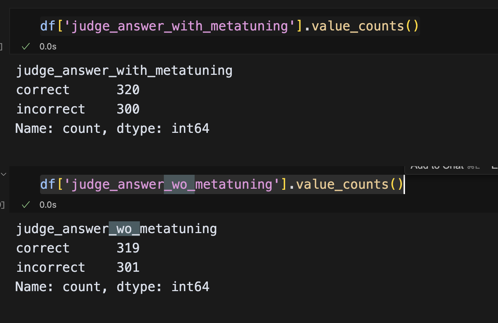

# Visual Gemini Judge Results Analysis

This repository contains the analysis of Gemini's performance on visual question answering tasks, comparing results with and without metatuning.

## Project Structure

```
Metatuning/
├── data/                      # Data directory
│   ├── raw/                   # Raw data files
│   │   ├── videos/            # Video files (video_00000.mp4 to video_00049.mp4)
│   │   └── questions/         # Question files
│   └── processed/             # Processed data
│       ├── judge-gemini-with-metatuning-clever.json
│       └── judge-gemini-wo-metatuning-clever.json
│
├── notebooks/                 # Jupyter notebooks
│   ├── visual_gemini_judge.ipynb
│   ├── text_eval/
│   │   └── cot-reflection-math500.ipynb
│   └── old_scripts/          # Archived notebooks
│
├── src/                      # Source code
│   ├── evaluation/           # Evaluation scripts
│   │   ├── create_dataframe.py
│   │   └── math_evaluation.py
│   └── utils/               # Utility functions
│
├── output_data/             # Output files
│   ├── 100_data_math500.csv
│   └── judge_results.csv
│
├── images/                  # Result images and plots
│   └── clever-dataset-result-gemini.png
│
├── .env                     # Environment variables
├── requirements.txt         # Python dependencies
└── README.md               # Project documentation
```

## Overview

The analysis evaluates Gemini's ability to answer questions about visual scenes, specifically focusing on:

- Object properties (color, shape, material)
- Object movements and interactions
- Counting objects with specific attributes
- Temporal relationships between events

## Dataset

The dataset consists of 10000 videos out of which 50 videos are choosen. The dataset is taken from the [CLEVER dataset](http://clevrer.csail.mit.edu/):

- 50 video files (video_00000.mp4 to video_00049.mp4)
- Multiple questions per video
- Two types of questions:
  - Descriptive: Questions about object properties and counts
  - Explanatory: Questions about causal relationships
  - Counterfactual

## Methodology

1. **Data Collection**:

   - Generated answers using Gemini with and without metatuning
   - Used an expert judge (GPT-4) to evaluate answer correctness
   - Stored results in JSON format for both conditions

2. **Evaluation**:

   - Created a structured DataFrame containing:
     - Video filename
     - Question index
     - Question text and type
     - Correct answer
     - LLM answers (with and without metatuning)
     - Judge evaluations (with and without metatuning)

3. **Analysis**:
   - Compared performance between metatuned and non-metatuned versions
   - Analyzed accuracy across different question types
   - Evaluated consistency in answers

## Results

The results are stored in `judge_results.csv` with the following columns:

- `video_filename`: Name of the video file
- `question_idx`: Index of the question
- `question`: The actual question text
- `question_type`: Type of question (descriptive/explanatory)
- `correct_answer`: Ground truth answer
- `llm_answer_with_metatuning`: Gemini's answer with metatuning
- `judge_answer_with_metatuning`: Judge's evaluation of metatuned answer
- `llm_answer_wo_metatuning`: Gemini's answer without metatuning
- `judge_answer_wo_metatuning`: Judge's evaluation of non-metatuned answer

## Key Findings

1. **Question Types**:

   - Descriptive questions focus on object properties and counts
   - Explanatory questions deal with causal relationships
   - Performance varies between question types

2. **Answer Format**:

   - Answers are evaluated for both correctness and format
   - Judge provides binary evaluation (correct/incorrect)
   - Case sensitivity and exact matches are considered

3. **Performance Comparison**:
   - Results show differences in accuracy between metatuned and non-metatuned versions
   - Specific patterns in types of questions where metatuning helps or doesn't help

## Usage

To analyze the results:

1. Use the resulting `judge_results.csv` for further analysis
2. The DataFrame contains all necessary information for detailed performance analysis

# Results



As we can see that there is no significant change with or with out metatuning. The performance remains unchanged.

## Future Work

Potential areas for further investigation:

- Detailed analysis of question type performance
- Error pattern analysis
- Comparison with other visual question answering models
- Investigation of specific cases where metatuning shows significant improvement
